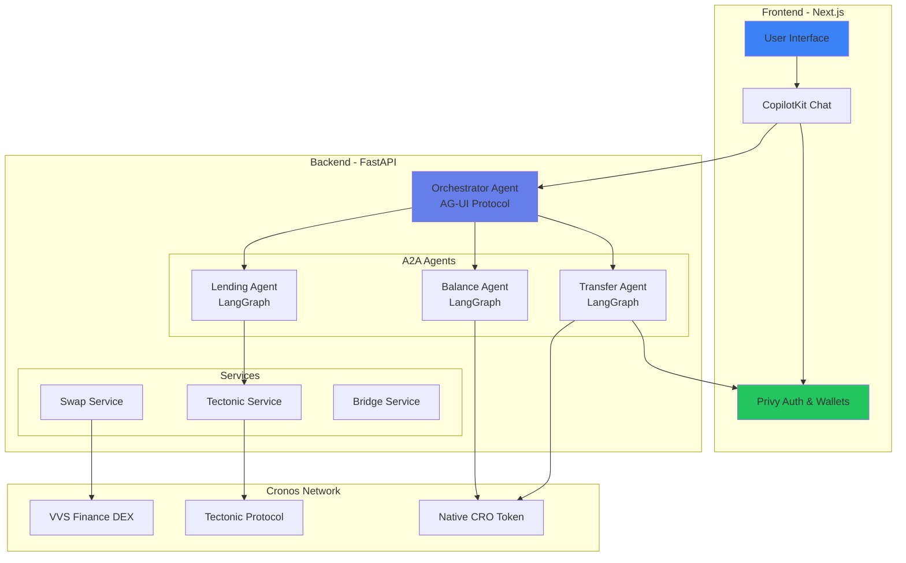
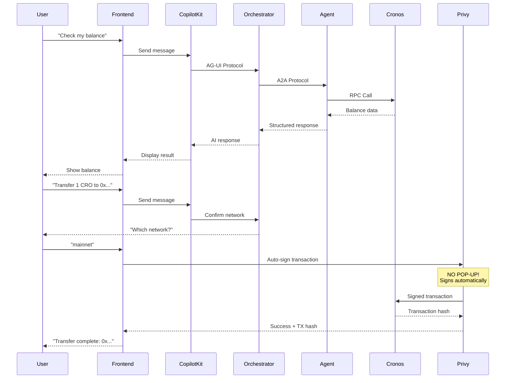
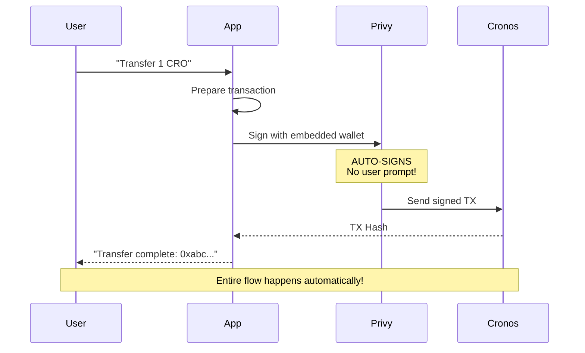

# Cronos x402 Paytech 🚀

<div align="center">

**Your AI-Powered Gateway to Cronos DeFi**

[](https://nextjs.org/)
[](https://fastapi.tiangolo.com/)
[](https://python.org/)
[](https://cronos.org/)

**Intelligent multi-agent AI platform for seamless DeFi operations on Cronos blockchain**

Built for the Cronos x402 Paytech Hackathon

[Features](#-key-features) • [Architecture](#-architecture) • [Quick Start](#-quick-start) • [Documentation](#-documentation)

</div>

---

---

## 📋 Table of Contents

- [Overview](#-overview)
- [Key Features](#-key-features)
- [Architecture](#-architecture)
- [Technology Stack](#-technology-stack)
- [Agent System](#-agent-system)
- [Privy Auto-Signing](#-privy-auto-signing-transaction-flow)
- [Quick Start](#-quick-start)
- [Detailed Setup](#-detailed-setup)
- [Environment Variables](#-environment-variables)
- [API Documentation](#-api-documentation)
- [Project Structure](#-project-structure)
- [Development](#-development)
- [Deployment](#-deployment)
- [Contributing](#-contributing)
- [License](#-license)

---

## 🎯 Overview

**Cronos x402 Paytech** is an advanced AI-powered DeFi platform that brings conversational intelligence to Cronos blockchain operations. Users interact with specialized AI agents through natural language, while **Privy's embedded wallets** handle transaction signing automatically in the background—no manual signature prompts required.

### What Makes It Special?

- **🤖 Conversational DeFi**: Chat naturally with AI agents to perform complex blockchain operations
- **⚡ Auto-Signing Transactions**: Privy embedded wallets sign transactions automatically—no pop-ups, no interruptions
- **🎯 Cronos-Native**: Built specifically for Cronos network with deep integration
- **🧠 Intelligent Orchestration**: Multi-agent system coordinates complex workflows seamlessly
- **🔐 Secure by Design**: Privy authentication with MPC wallet technology
- **💳 x402 Payment Protocol**: Built-in payment infrastructure for premium features

---

## ✨ Key Features

### 🎭 Multi-Agent Intelligence

| Agent | Purpose | Capabilities |
|-------|---------|--------------|
| **🔍 Balance Agent** | Account monitoring | Check CRO & token balances across Cronos network |
| **💸 Transfer Agent** | Token transfers | Send native CRO with auto-signed transactions |
| **🔄 Swap Agent** | Token swapping | DEX integration with VVS Finance |
| **🌉 Bridge Agent** | Cross-chain bridging | Move assets between chains |
| **🏦 Lending Agent** | DeFi lending | Interact with lending protocols |
| **🎯 Tectonic Agent** | Tectonic Protocol | Supply, borrow, repay, withdraw operations |
| **🎼 Orchestrator** | Coordination | Manages agent workflows and conversations |

### 🔐 Privy Auto-Signing

- **Embedded Wallets**: MPC-based wallets with automatic transaction signing
- **No Pop-ups**: Transactions sign in the background without user interruption
- **Secure by Default**: Non-custodial security with seamless UX
- **Multi-Wallet Support**: Works with embedded wallets (auto-sign) and external wallets (MetaMask, etc.)

### 🌐 Cronos Integration

- **Native CRO Operations**: Balance checks, transfers, and token management
- **VVS Finance Integration**: Decentralized exchange operations
- **Tectonic Protocol**: Supply, borrow, repay lending operations
- **Network Flexibility**: Supports both mainnet and testnet

### 💬 Natural Language Interface

- **CopilotKit Integration**: Professional AI chat interface
- **Context-Aware**: Remembers wallet address and transaction history
- **Multi-Step Operations**: Handles complex workflows through conversation
- **Error Handling**: Intelligent error recovery and suggestions

---

## 🏗 Architecture

### System Overview



### Protocol Architecture



### Data Flow

```
┌─────────────────────────────────────────────────────────────┐
│                         USER LAYER                          │
│  Natural Language Input → Conversational AI Interface       │
└─────────────────────┬───────────────────────────────────────┘
                      │
                      ▼
┌─────────────────────────────────────────────────────────────┐
│                    ORCHESTRATION LAYER                      │
│  AG-UI Protocol → Gemini-Powered Orchestrator              │
│  • Intent Recognition  • Context Management                 │
│  • Agent Selection    • Workflow Coordination               │
└─────────────────────┬───────────────────────────────────────┘
                      │
                      ▼
┌─────────────────────────────────────────────────────────────┐
│                      AGENT LAYER                            │
│  A2A Protocol → LangGraph Agents                           │
│  Balance │ Transfer │ Lending │ Bridge │ Swap              │
└─────────────────────┬───────────────────────────────────────┘
                      │
                      ▼
┌─────────────────────────────────────────────────────────────┐
│                   BLOCKCHAIN LAYER                          │
│  Cronos Network → VVS Finance, Tectonic, Native CRO       │
└─────────────────────────────────────────────────────────────┘
```

---

## 💻 Technology Stack

### Frontend

| Technology | Purpose | Version |
|------------|---------|---------|
| **Next.js** | React framework with App Router | 15.1.6 |
| **TypeScript** | Type-safe JavaScript | ^5 |
| **Tailwind CSS** | Utility-first styling | ^3.4.17 |
| **CopilotKit** | AI chat interface | ^1.3.23 |
| **Privy** | Authentication & embedded wallets | ^1.93.1 |
| **Viem** | Ethereum library for transactions | ^2.21.58 |
| **@ag-ui/client** | AG-UI protocol client | ^0.0.30 |

### Backend

| Technology | Purpose | Version |
|------------|---------|---------|
| **FastAPI** | Modern Python web framework | 0.115.6 |
| **Python** | Backend language | 3.11+ |
| **LangGraph** | Agent workflow orchestration | ^0.2.66 |
| **LangChain** | LLM integration framework | ^0.3.19 |
| **Starlette** | ASGI framework for A2A | 0.41.3 |
| **Pydantic** | Data validation | ^2.10.5 |
| **web3.py** | Ethereum interactions | ^7.6.0 |

### Blockchain & APIs

- **Cronos Network**: Primary blockchain (EVM-compatible)
- **VVS Finance**: DEX for token swaps
- **Tectonic Protocol**: Lending and borrowing
- **Privy MPC Wallets**: Non-custodial embedded wallets
- **Gemini 2.0 Flash**: Orchestrator LLM
- **Claude Haiku 4.5**: Agent reasoning engine

---

## 🤖 Agent System

### Agent Architecture

Each agent follows the **LangGraph** state machine pattern:

```python
# Agent State Machine
START → Validate Input → Execute Action → Format Response → END
         ↓                 ↓
    Error Handler    Retry Logic
```

### 1. Balance Agent 💰

**Purpose**: Check cryptocurrency balances on Cronos

**Capabilities**:
- Native CRO balance checking
- ERC-20 token balance queries (USDC, USDT, DAI, etc.)
- Multi-address support
- Cached responses for performance

**Input**:
```json
{
  "address": "0x742d35Cc6634C0532925a3b844Bc9e7595f0bEb",
  "network": "cronos",
  "token": "USDC" // Optional
}
```

**Output**:
```json
{
  "balance": "125.43",
  "symbol": "CRO",
  "network": "cronos",
  "formatted": "125.43 CRO"
}
```

### 2. Transfer Agent ✈️

**Purpose**: Send native CRO tokens with auto-signing

**Capabilities**:
- Native CRO transfers
- Mainnet and testnet support
- Privy auto-signing integration
- Transaction hash tracking

**Flow**:
```
1. User: "Transfer 1 CRO to 0x..."
2. Agent: "Which network? mainnet or testnet?"
3. User: "mainnet"
4. Agent: Calls initiate_transfer action
5. Privy: Auto-signs transaction (NO POP-UP!)
6. Cronos: Executes transaction
7. User: Receives TX hash for tracking
```

**Critical**: Always requires network confirmation before execution!

### 3. Lending Agent 🏦

**Purpose**: Interact with Tectonic lending protocol

**Capabilities**:
- Supply assets to earn interest
- Borrow against collateral
- Repay loans
- Withdraw supplied assets
- Check market data

### 4. Orchestrator Agent 🎼

**Purpose**: Coordinate all agents and manage conversations

**Capabilities**:
- Intent recognition from natural language
- Agent selection and routing
- Context management (wallet address, transaction history)
- Multi-step workflow coordination
- Error handling and recovery

**Protocol**: AG-UI (Agent-to-GUI User Interface)

---

## 🔐 Privy Auto-Signing Transaction Flow

### Traditional Wallet Flow (❌ Old Way)

```
User clicks "Transfer" → MetaMask pop-up → User confirms → Transaction sent
                            ↑
                    (Interrupts workflow)
```

### Privy Auto-Signing Flow (✅ New Way)



### How It Works

1. **Embedded Wallet Creation**:
   ```typescript
   // Privy creates MPC wallet automatically on user signup
   const { wallets } = useWallets();
   const embeddedWallet = wallets.find(w => w.walletClientType === 'privy');
   ```

2. **Auto-Signing Transfers**:
   ```typescript
   // NO pop-up, NO interruption
   const result = await transferCRO({
     wallet: embeddedWallet,  // Privy embedded wallet
     recipient: "0x...",
     amount: "1.0",
     network: "mainnet"
   });
   // Transaction auto-signed and sent!
   ```

3. **Security Model**:
   - **Non-custodial**: User controls private keys via MPC
   - **No seed phrases**: Keys distributed across multiple parties
   - **Secure by design**: Privy handles all cryptographic operations
   - **Progressive security**: Can add 2FA, passkeys, etc.

### Configuration

```typescript
// app/providers.tsx
<PrivyProvider
  appId={process.env.NEXT_PUBLIC_PRIVY_APP_ID}
  config={{
    embeddedWallets: {
      createOnLogin: 'users-without-wallets', // Auto-create wallets
      requireUserPasswordOnCreate: false,      // No password needed
    },
    appearance: { theme: 'light' },
    loginMethods: ['email', 'wallet', 'google'], // Multiple auth options
  }}
>
```

---

## 🚀 Quick Start

### Prerequisites

- **Node.js** 18+ and npm
- **Python** 3.11+
- **Git**
- **Privy Account**: Get free API key from [dashboard.privy.io](https://dashboard.privy.io)
- **LLM API Keys**: Google Gemini (orchestrator), Anthropic Claude (agents)

### 1. Clone Repository

```bash
git clone https://github.com/RadiantHack/Cronosx402-.git
cd Cronosx402-
```

### 2. Frontend Setup (5 minutes)

```bash
cd frontend
npm install

# Create .env.local
cat > .env.local << EOF
NEXT_PUBLIC_PRIVY_APP_ID=your-privy-app-id-here
NEXT_PUBLIC_BASE_URL=http://localhost:8000
EOF

# Start development server
npm run dev
```

✅ Frontend running at [http://localhost:3000](http://localhost:3000)

### 3. Backend Setup (5 minutes)

```bash
cd ../backend

# Create virtual environment
python -m venv venv
source venv/bin/activate  # Windows: venv\Scripts\activate

# Install dependencies
pip install -e ".[dev]"

# Create .env file
cp .env.example .env

# Edit .env and add your API keys:
# - GOOGLE_API_KEY (for Gemini orchestrator)
# - ANTHROPIC_API_KEY (for Claude agents)
# - CRONOS_RPC_URL (optional, has defaults)

# Start backend server
cd ..
make backend-dev
```

✅ Backend running at [http://localhost:8000](http://localhost:8000)

### 4. Test the Application

1. Open [http://localhost:3000](http://localhost:3000)
2. Click **"Connect Wallet"** → Sign in with email/Google
3. Privy creates your embedded wallet automatically
4. Navigate to **"New Chat"**
5. Try these commands:
   - `"Check my balance"` ← Uses your connected wallet automatically
   - `"Transfer 0.1 CRO to 0x742d35Cc6634C0532925a3b844Bc9e7595f0bEb"` ← Auto-signs!
   - `"What's the price of CRO?"` ← Orchestrator coordinates agents

🎉 **You're ready!** Transactions will auto-sign with your Privy embedded wallet.

---

## 📚 Detailed Setup

### Frontend Setup

1. **Install dependencies:**
   ```bash
   cd frontend
   npm install
   ```

2. **Configure environment variables:**
   
   Create `.env.local` file:
   ```bash
   # Required: Privy Authentication
   NEXT_PUBLIC_PRIVY_APP_ID=your-privy-app-id-here
   
   # Optional: Backend URL (defaults to localhost:8000)
   NEXT_PUBLIC_BASE_URL=http://localhost:8000
   
   # Optional: CopilotKit (if using cloud version)
   NEXT_PUBLIC_COPILOTKIT_API_KEY=your-copilotkit-key
   ```

3. **Get Privy App ID:**
   - Visit [dashboard.privy.io](https://dashboard.privy.io)
   - Create new app or use existing
   - Copy App ID from Settings
   - Enable "Embedded Wallets" feature

4. **Run development server:**
   ```bash
   npm run dev
   ```

5. **Build for production:**
   ```bash
   npm run build
   npm start
   ```

### Backend Setup (Local)

1. **Create virtual environment:**
   ```bash
   cd backend
   python -m venv venv
   
   # Activate (macOS/Linux)
   source venv/bin/activate
   
   # Activate (Windows)
   venv\Scripts\activate
   ```

2. **Install dependencies:**
   ```bash
   pip install -e ".[dev]"
   ```

3. **Configure environment variables:**
   
   Create `.env` file:
   ```bash
   # Required: LLM API Keys
   GOOGLE_API_KEY=your-google-gemini-api-key
   ANTHROPIC_API_KEY=your-anthropic-claude-api-key
   
   # Optional: Cronos RPC (has defaults)
   CRONOS_RPC_URL=https://evm.cronos.org
   CRONOS_TESTNET_RPC_URL=https://evm-t3.cronos.org
   
   # Optional: x402 Payment (for premium features)
   CRONOS_PAY_TO=0x...  # Your payment recipient address
   
   # Optional: Server Config
   AGENTS_PORT=8000
   RENDER_EXTERNAL_URL=http://localhost:8000
   ```

4. **Run development server:**
   ```bash
   # From project root
   make backend-dev
   
   # Or from backend directory
   uvicorn app.main:app --reload --host 0.0.0.0 --port 8000
   ```

5. **Verify installation:**
   - Health: [http://localhost:8000/health](http://localhost:8000/health)
   - Docs: [http://localhost:8000/docs](http://localhost:8000/docs)

### Backend Setup (Docker)

1. **Configure environment:**
   ```bash
   cp backend/.env.example backend/.env
   # Edit backend/.env with your API keys
   ```

2. **Build and run:**
   ```bash
   # From project root
   make docker-up
   
   # Or from backend directory
   cd backend
   docker-compose up --build
   ```

3. **Useful commands:**
   ```bash
   make docker-down        # Stop containers
   make docker-logs        # View logs
   make docker-shell       # Open shell in container
   make docker-test        # Run tests
   make docker-format      # Format code
   ```

---

## 🔧 Environment Variables

### Frontend (.env.local)

| Variable | Required | Description | Example |
|----------|----------|-------------|---------|
| `NEXT_PUBLIC_PRIVY_APP_ID` | ✅ Yes | Privy application ID | `clpr12...` |
| `NEXT_PUBLIC_BASE_URL` | No | Backend API URL | `http://localhost:8000` |
| `NEXT_PUBLIC_COPILOTKIT_API_KEY` | No | CopilotKit cloud API key | `ck_...` |

### Backend (.env)

| Variable | Required | Description | Default |
|----------|----------|-------------|---------|
| `GOOGLE_API_KEY` | ✅ Yes | Google Gemini API key | - |
| `ANTHROPIC_API_KEY` | ✅ Yes | Anthropic Claude API key | - |
| `CRONOS_RPC_URL` | No | Cronos mainnet RPC | `https://evm.cronos.org` |
| `CRONOS_TESTNET_RPC_URL` | No | Cronos testnet RPC | `https://evm-t3.cronos.org` |
| `AGENTS_PORT` | No | Server port | `8000` |
| `RENDER_EXTERNAL_URL` | No | Public URL for agent cards | `http://localhost:8000` |
| `CRONOS_PAY_TO` | No | x402 payment recipient | - |

---

## 📖 API Documentation

### Backend Endpoints

Once backend is running, access interactive documentation:

- **Swagger UI**: [http://localhost:8000/docs](http://localhost:8000/docs)
- **ReDoc**: [http://localhost:8000/redoc](http://localhost:8000/redoc)
- **Health Check**: [http://localhost:8000/health](http://localhost:8000/health)

### Agent Endpoints

Each agent exposes A2A Protocol endpoints:

| Agent | Card URL | Protocol |
|-------|----------|----------|
| Balance | `/balance/.well-known/agent-card.json` | A2A |
| Transfer | `/transfer/.well-known/agent-card.json` | A2A |
| Lending | `/lending/.well-known/agent-card.json` | A2A |
| Bridge | `/bridge/.well-known/agent-card.json` | A2A |
| Orchestrator | `/orchestrator` | AG-UI |

### Example: Balance API

**Structured JSON Endpoint:**
```bash
curl -X POST http://localhost:8000/api/balance \
  -H "Content-Type: application/json" \
  -d '{
    "address": "0x742d35Cc6634C0532925a3b844Bc9e7595f0bEb",
    "network": "cronos"
  }'
```

**Response:**
```json
{
  "address": "0x742d35Cc6634C0532925a3b844Bc9e7595f0bEb",
  "network": "cronos",
  "native_balance": {
    "balance": "125.43",
    "symbol": "CRO",
    "decimals": 18
  }
}
```

---

## 📁 Project Structure

```
Cronosx402-/
├── frontend/                    # Next.js frontend application
│   ├── app/
│   │   ├── api/
│   │   │   └── copilotkit/     # CopilotKit API route (AG-UI)
│   │   ├── components/         # React components
│   │   │   ├── sidebar.tsx     # Navigation sidebar
│   │   │   ├── payment-modal.tsx
│   │   │   └── tectonic-*.tsx  # Tectonic UI components
│   │   ├── lib/                # Utility functions
│   │   │   ├── transfer/       # Transfer utilities
│   │   │   └── balance/        # Balance utilities
│   │   ├── balance/            # Balance page
│   │   ├── chat/               # AI chat interface
│   │   ├── transfer/           # Transfer page
│   │   ├── swap/               # Swap page
│   │   ├── bridge/             # Bridge page
│   │   ├── tectonic/           # Tectonic lending page
│   │   ├── layout.tsx          # Root layout
│   │   ├── page.tsx            # Home page
│   │   └── providers.tsx       # App providers (Privy, CopilotKit)
│   ├── public/                 # Static assets
│   ├── package.json            # Frontend dependencies
│   └── next.config.ts          # Next.js configuration
│
├── backend/                     # FastAPI backend application
│   ├── app/
│   │   ├── agents/             # AI agent implementations
│   │   │   ├── balance/        # Balance agent (LangGraph)
│   │   │   ├── transfer/       # Transfer agent (LangGraph)
│   │   │   ├── lending/        # Lending agent (LangGraph)
│   │   │   ├── bridge/         # Bridge agent (LangGraph)
│   │   │   ├── swap/           # Swap agent
│   │   │   ├── tectonic/       # Tectonic agent
│   │   │   └── orchestrator/   # Orchestrator (AG-UI)
│   │   ├── tectonic/           # Tectonic protocol service
│   │   ├── x402/               # x402 payment middleware
│   │   ├── facilitator/        # Payment facilitator service
│   │   └── main.py             # FastAPI app entry point
│   ├── tests/                  # Backend tests
│   ├── Dockerfile              # Docker configuration
│   ├── docker-compose.yml      # Docker Compose config
│   ├── pyproject.toml          # Python dependencies
│   └── Makefile                # Development commands
│
├── Makefile                     # Project-wide commands
├── README.md                    # This file
└── PHASE_6_COMPLETION_REPORT.md # Development documentation
```

---

## 🛠 Development

### Available Commands (Project Root)

```bash
# Frontend
make frontend-install      # Install frontend dependencies
make frontend-dev         # Start frontend dev server
make frontend-build       # Build frontend for production

# Backend (Local)
make backend-install      # Install backend dependencies
make backend-dev         # Start backend dev server
make backend-test        # Run backend tests
make backend-format      # Format Python code with Black
make backend-lint        # Lint Python code

# Backend (Docker)
make docker-up           # Start backend in Docker
make docker-down         # Stop Docker containers
make docker-logs         # View Docker logs
make docker-shell        # Open shell in Docker container
make docker-test         # Run tests in Docker
make docker-format       # Format code in Docker
```

### Code Quality

**Frontend:**
```bash
cd frontend
npm run lint            # ESLint
npm run type-check      # TypeScript check
npm run format          # Prettier
```

**Backend:**
```bash
cd backend
make format             # Black formatter
make lint               # Ruff linter
make type-check         # MyPy type checker
pytest                  # Run tests
```

### Adding New Agents

1. **Create agent directory:**
   ```bash
   cd backend/app/agents
   mkdir my_new_agent
   touch my_new_agent/__init__.py
   touch my_new_agent/agent.py
   ```

2. **Implement agent (LangGraph):**
   ```python
   # my_new_agent/agent.py
   from langgraph.graph import StateGraph, END
   from a2a import A2AStarletteApplication
   
   def create_my_agent_app(card_url: str) -> A2AStarletteApplication:
       # Define state, graph, and logic
       workflow = StateGraph(...)
       # Build and return A2A app
       return A2AStarletteApplication(...)
   ```

3. **Register in main.py:**
   ```python
   from app.agents.my_new_agent.agent import create_my_agent_app
   
   # In register_agents():
   my_agent_app = create_my_agent_app(card_url=f"{base_url}/my_agent")
   app.mount("/my_agent", my_agent_app.build())
   ```

4. **Add to CopilotKit route:**
   ```typescript
   // frontend/app/api/copilotkit/route.ts
   const myAgentUrl = `${baseUrl}/my_agent`;
   
   const a2aMiddlewareAgent = new A2AMiddlewareAgent({
     agentUrls: [balanceAgentUrl, transferAgentUrl, myAgentUrl],
     // ...
   });
   ```

---

## 🚀 Deployment

### Frontend Deployment (Vercel)

1. **Push to GitHub**
2. **Connect to Vercel:**
   - Import repository
   - Add environment variables (`.env.local` values)
   - Deploy

3. **Environment Variables (Vercel):**
   - `NEXT_PUBLIC_PRIVY_APP_ID`
   - `NEXT_PUBLIC_BASE_URL` (your backend URL)

### Backend Deployment (Railway)

1. **Push to GitHub**
2. **Connect to Railway:**
   - New Project → Deploy from GitHub
   - Select repository
   - Add environment variables

3. **Environment Variables (Railway):**
   - `GOOGLE_API_KEY`
   - `ANTHROPIC_API_KEY`
   - `CRONOS_RPC_URL`
   - `RENDER_EXTERNAL_URL` (your Railway URL)

4. **Railway Configuration:**
   ```json
   {
     "build": {
       "builder": "DOCKERFILE",
       "dockerfilePath": "backend/Dockerfile"
     },
     "deploy": {
       "startCommand": "uvicorn app.main:app --host 0.0.0.0 --port $PORT"
     }
   }
   ```

### Docker Deployment

```bash
# Build images
docker-compose -f backend/docker-compose.yml build

# Run in production
docker-compose -f backend/docker-compose.yml up -d

# Scale services
docker-compose -f backend/docker-compose.yml up --scale backend=3
```

---

## 🤝 Contributing

We welcome contributions! Please follow these guidelines:

1. **Fork the repository**
2. **Create a feature branch:**
   ```bash
   git checkout -b feature/amazing-feature
   ```
3. **Make your changes**
4. **Run tests and linting:**
   ```bash
   # Frontend
   cd frontend
   npm run lint
   npm run type-check
   
   # Backend
   cd backend
   make format
   make lint
   pytest
   ```
5. **Commit with descriptive message:**
   ```bash
   git commit -m "feat: Add amazing feature"
   ```
6. **Push to your fork:**
   ```bash
   git push origin feature/amazing-feature
   ```
7. **Open a Pull Request**

### Commit Convention

We follow [Conventional Commits](https://www.conventionalcommits.org/):

- `feat:` New feature
- `fix:` Bug fix
- `docs:` Documentation changes
- `refactor:` Code refactoring
- `test:` Test additions/changes
- `chore:` Build/config changes

---

## 📄 License

This project is licensed under the MIT License - see the [LICENSE](LICENSE) file for details.

---

## 🙏 Acknowledgments

- **Cronos**: For the amazing blockchain infrastructure
- **Privy**: For seamless wallet authentication and auto-signing
- **CopilotKit**: For the AI chat interface framework
- **LangChain/LangGraph**: For agent orchestration
- **Google Gemini**: For orchestrator intelligence
- **Anthropic Claude**: For agent reasoning
- **VVS Finance**: For DEX integration
- **Tectonic Protocol**: For lending infrastructure

---

## 📞 Support

- **Documentation**: This README
- **Issues**: [GitHub Issues](https://github.com/RadiantHack/Cronosx402-/issues)
- **Discussions**: [GitHub Discussions](https://github.com/RadiantHack/Cronosx402-/discussions)

---

## 🎯 Roadmap

### ✅ Completed (Phase 6)
- [x] Multi-agent architecture with LangGraph
- [x] Privy auto-signing integration
- [x] Balance and Transfer agents
- [x] Tectonic lending integration
- [x] VVS Finance swap integration
- [x] CopilotKit conversational UI
- [x] AG-UI + A2A protocol implementation

### 🚧 In Progress
- [ ] Advanced error handling and retry logic
- [ ] Transaction history tracking
- [ ] Multi-wallet support
- [ ] Gas optimization strategies

### 🔮 Future Plans
- [ ] Additional DEX integrations
- [ ] NFT marketplace agents
- [ ] Cross-chain bridge expansion
- [ ] Portfolio analytics dashboard
- [ ] Mobile app (React Native)
- [ ] Advanced trading strategies

---

<div align="center">

**Built with ❤️ for the Cronos x402 Paytech Hackathon**

[⬆ Back to Top](#cronos-x402-paytech-)

</div>
